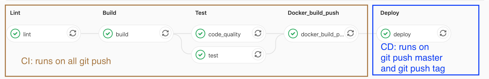

## Description

This is a proposed solution to [this devops test](https://github.com/tmdzk/simple-test).

It's live here: https://devops-test-q7n537vqcq-ew.a.run.app/

#### 1. Code and design a simple api following those endpoints, storage/database can be either a fs or db:

- I used [Nest](https://github.com/nestjs/nest) to create the API

- I chose a managed postgres database at [Google Cloud SQL](https://cloud.google.com/sql/docs/postgres/) to store the graduation data

#### 2. Design how you would deploy your solution to a cloud provider (AWS, GCP, Azure, Scaleway..)

I chose to deploy this into [Google Cloud Run](https://cloud.google.com/run/).

Here's why:

- Like serverless but more flexible
- Deployment is super easy
- Environment variables are injected into the container (useful for configuring a database connection etc.)
- Scales down to zero!
- I can move to another cloud service easily because it's just a docker container

I would create the GCP infra (Cloud SQL, Service Accounts etc.) using terraform (not done yet)

#### 3. Make a graph on how you would manage CI/CD for your solution.

I used Gitlab-CI for CI/CD:



## Installation

```bash
$ npm install
```

## Running the app

```bash
# development
$ npm run start

# watch mode
$ npm run start:dev

# production mode
$ npm run start:prod
```

## Test

```bash
# unit tests
$ npm run test

# e2e tests
$ npm run test:e2e

# test coverage
$ npm run test:cov
```

## Stay in touch

- Author - [Princy Razafimanantsoa](https://www.princy.dev/)
- Twitter - [@princyraza](https://twitter.com/princyraza)

## License

This project is [MIT licensed](LICENSE).
